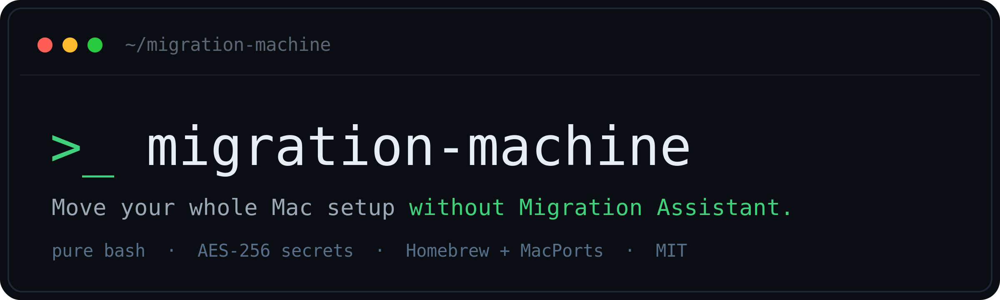

<p align="center">
  
</p>

<p align="center">
  <a href="https://github.com/callmesukhi/migration-machine/actions/workflows/ci.yml"></a>
  <a href="https://github.com/callmesukhi/migration-machine/actions/workflows/site.yml"></a>
  <a href="https://github.com/callmesukhi/migration-machine/actions/workflows/pages.yml"></a>
  <a href="LICENSE"></a>
</p>

# migration-machine

Move your whole Mac setup to a new machine without Migration Assistant or Time Machine. Capture your config on the old Mac, carry one folder across, and provision the new Mac from a manifest you control.

It is a small, dependency-light, manifest-driven engine with modular step scripts. You decide what runs by editing JSON, not by hacking the engine.

## Guided setup (fastest)

One command, then a clickable, step-by-step UI. No `git clone`, no flags to learn:

```bash
curl -fsSL https://migration-machine.callmesukhi.com/install.sh | bash
```

This downloads migration-machine and launches a guided setup powered by [swiftDialog](https://github.com/swiftDialog/swiftDialog). It walks you through backing up your old Mac or setting up the new one: on the backup path, it confirms and then starts `migrate capture` without a dry-run preview; on the new-Mac setup path, it helps build your manifest and previews each provisioning step as a dry run before anything changes. Already cloned the repo? Just run `./migrate wizard`.

Prefer to read the installer before piping it to a shell (a good habit):

```bash
curl -fsSL https://migration-machine.callmesukhi.com/install.sh -o install.sh
less install.sh
bash install.sh
```

The hands-on path below is unchanged for anyone who would rather drive it from the command line.

## Status &amp; testing

Early (`0.1.x`). Use it with eyes open.

What is tested: the engine's control flow is covered by `tests/run.sh` and runs in CI on every push (manifest parsing, validation skip/confirm, dry-run, `--only`, optional vs. required failure, abort). This logic is OS-independent, so the tests run on Linux.

What is NOT yet verified: the macOS-specific commands have conventional implementations but have not been exercised on real hardware end to end. That includes the Xcode CLT install, Homebrew/MacPorts install, `hdiutil` encrypt/mount of the secrets bundle, `defaults` import, the `pam_tid` sudo edit, and the swiftDialog UI. Always run `--dry-run` first and treat your first real run as a rehearsal on a spare Mac or VM.

Tested on (verified end to end):

| macOS | Chip | Package manager | By |
| --- | --- | --- | --- |
| _none yet_ | | | |

If you run it for real, a PR adding a row here is the most valuable contribution you can make.

## What it does

- Captures dotfiles, `~/.config`, a Homebrew `Brewfile`, editor settings + extension lists, app preference plists, macOS system defaults, and browser bookmarks. Secrets (SSH/GPG keys, tokens) go into an AES-256 encrypted disk image, never plaintext.
- Provisions a fresh Mac: Xcode Command Line Tools, a package manager (Homebrew or MacPorts), your packages, your dotfiles repo, macOS settings, captured app config, and TouchID-for-sudo.
- Runs each step only if it is not already satisfied, shows progress in swiftDialog when a GUI session exists and a clean CLI list otherwise, and stops on a failed required step.

## Tool vs. data

The repo is the tool. Your captured config is data, kept in a separate directory so you can carry it between machines (a cloud-synced folder, a USB drive, whatever). Point at it with `--data DIR` or the `MIGRATION_DATA` environment variable. Default: `~/migration-data`.

```
migration-machine/        the tool (this repo)
  migrate                 entrypoint
  lib/                    engine + capture/restore implementations
  steps/                  one script per provisioning step
  manifests/              example manifests (copy + customize)
  docs/                   RUNBOOK, MANIFEST schema

$MIGRATION_DATA/          your data (NOT in the repo)
  payload/  manifest/  secrets/  logs/  backups/
```

## Quick start

On the OLD Mac:

```bash
git clone https://github.com/callmesukhi/migration-machine.git
cd migration-machine
./migrate --data ~/Sync/migration capture
```

Carry `~/Sync/migration` to the new Mac (cloud sync, drive, etc.).

On the NEW Mac:

```bash
git clone https://github.com/callmesukhi/migration-machine.git
cd migration-machine
cp manifests/example-homebrew.json manifests/local-mymac.json   # then edit it
./migrate --data ~/Sync/migration provision -m local-mymac --dry-run   # preview
./migrate --data ~/Sync/migration bootstrap -m local-mymac             # do it
```

`bootstrap` installs the Command Line Tools first, then provisions. If git already works, `provision` is enough.

## Commands

```
migrate [--data DIR] capture                 export this Mac's config (OLD Mac)
migrate [--data DIR] provision -m MANIFEST    provision from a manifest (NEW Mac)
migrate [--data DIR] provision --list         list available manifests
migrate [--data DIR] provision -m M --dry-run preview, change nothing
migrate [--data DIR] provision -m M --only ID run a single step
migrate [--data DIR] restore --only PHASE     restore captured config only
migrate [--data DIR] bootstrap -m MANIFEST    ensure Xcode CLT, then provision
MIGRATE_UI=cli|gui|auto                       force the progress UI (default auto)
```

## Manifests

A manifest is a `config` object plus an ordered list of `steps`, each with a `validation` check and a `required` flag. Copy an example, point `dotfilesRepo` at your own repo, and edit the steps. Full schema in [docs/MANIFEST.md](docs/MANIFEST.md). Keep your real manifest private; `local-*.json` is gitignored.

## Security

- Secrets live in an AES-256 encrypted `.dmg`. Its safety is your passphrase. Use a strong one and store it in a password manager.
- If you host the bundle anywhere fetchable, treat that URL as sensitive and expire it after use.
- Run from a Terminal: secrets restore prompts for the passphrase and several steps use `sudo`. The GUI shows progress but does not collect the passphrase.

## What it does not do

Re-granting app permissions (Full Disk Access, Accessibility, Screen Recording), app sign-ins, license keys, and Keychain are not automated by design. See [docs/RUNBOOK.md](docs/RUNBOOK.md) for the manual checklist.

## Credit

The design borrows ideas from three excellent projects: the manifest-of-steps with per-step validation and a swiftDialog progress UI is inspired by [Setup Your Mac](https://github.com/dan-snelson/Setup-Your-Mac); the modular provisioning scripts and curl-able bootstrap echo [boblbee](https://github.com/matdotcx/boblbee); the clone-and-symlink, Brewfile-driven config model is the common dotfiles pattern. Code here is original; the good ideas are theirs.

## License

MIT. See [LICENSE](LICENSE).
